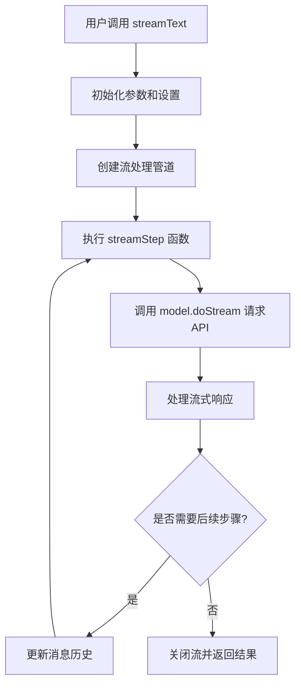
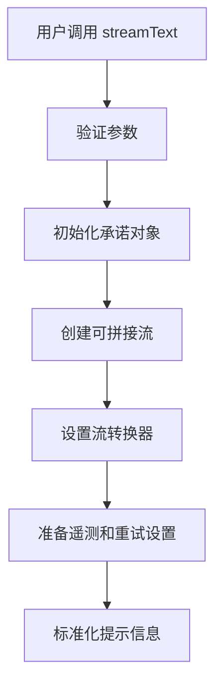
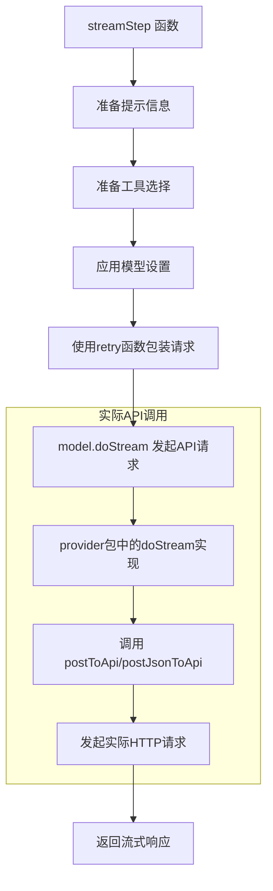
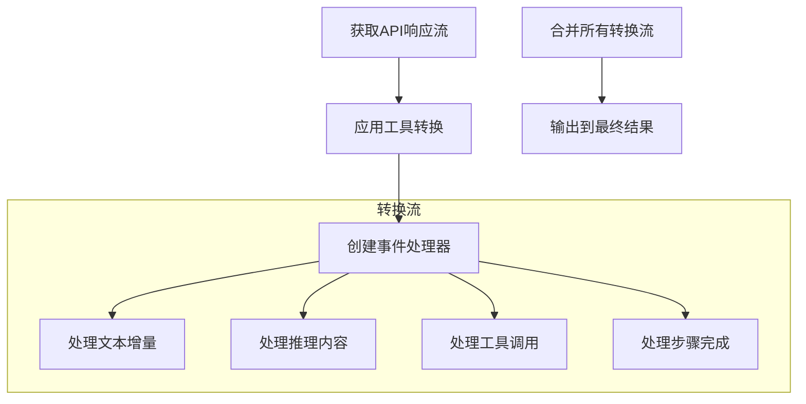
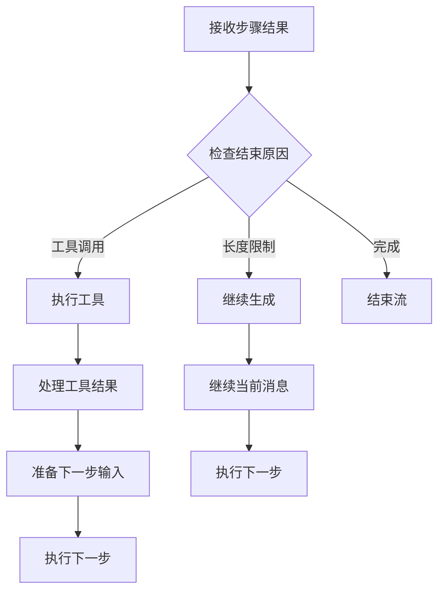
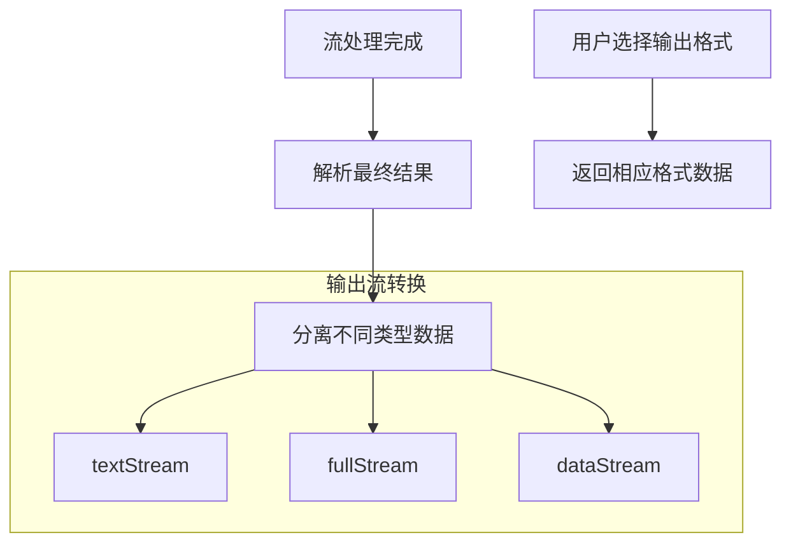

## 背景

在开发 AI 工具的时候，自己使用 fetch 调用 AI 的 api ，然后发现在并发的场景下会出现问题，经过询问得知社区的开源项目： https://github.com/vercel/ai ，直接能够解决我的问题，使用下来确实是这样，于是打算研究一下它是如何实现的

## 目的

找到源码中 streamText 的实现，然后找到它是如何支持并发请求的

## streamText 功能解析

这个 API 的官方文档： https://sdk.vercel.ai/docs/reference/ai-sdk-core/stream-text

它接受的输入：
- model：使用的语言模型
- system：将作为提示部分内容的系统消息。
- tools： 可供模型访问和调用的工具集。模型需支持工具调用功能。
-  prompt：简单文本提示。`prompt` 和 `messages` 参数不可同时使用。
- messages： 消息列表。`prompt` 和 `messages` 参数不可同时使用。
- 还有很多。。。
它返回的输出：
- **textStream**：一个仅返回生成文本增量的文本流。您可将其作为 AsyncIterable 或 ReadableStream 使用。当发生错误时，该流会抛出错误。
- 还有很多。。。
除了上面的参数还有很多参数，但是我们的目的是搞清楚它发送请求的逻辑，所以就不一一列举了！
## 源码阅读

**这里我的目标是找到如何发送请求，处理数据，然后如何返回内容的**

1）安装源码
```bash
git clone git@github.com:vercel/ai.git
```
安装好后，我使用 Cursor 打开

2）找到源码地址

我知道我是从 ai 里面导出的 streamText ，所以它肯定在 ai 目录下,于是我找到了，它在这里：`vercel/ai/packages/ai/core/generate-text/stream-text.ts` 。但是居然高达 1600 行，我还是去玩游戏吧！（那是不可能的）

可以看到这里返回的是一个 DefaultStreamTextResult 的实例，这里代码逻辑过于复杂，借助 AI，我找到了相关代码部分：

这里可以看到它调用了 模型自己的 doStream 方法来获取结果，streamText 是负责准备请求数据，然后调用 model.doStream() => 处理返回的数据

所以我们去看模型自己如何写 doStream 方法，这里我看的是 openai ，我们去：`packages/openai/src/openai-chat-language-model.ts` ，这里我们可以看到：

这里调用 @ai-sdk/provider-utils 的 postJsonToApi 方法，我们继续去`packages/provider-utils/src/post-to-api.ts` 然后可以看到 postJsonToApi 返回 PostToApi ，所以我们看这个方法：


这就是我们要找的方法，我们详细看一下：
它接收：
 - url：目标API的URL
 - headers：请求头信息
 - body：请求体(包含content和values)
 - successfulResponseHandler：成功响应处理器
 - failedResponseHandler：失败响应处理器
 - abortSignal：中止信号
 - fetch = getOriginalFetch()： fetch实现(默认为全局fetch)
它返回：将 response 传给 successfulResponseHandler。也就是说它返回的是 successfulResponseHandler 函数执行的返回
然后：
1）发送 http 请求
2）提取、处理响应头
3）错误处理，这里通过多步处理然后抛出错误
4）成功处理，也通过 try catch 保证成功处理过程中错误能抛出
5）网络错误处理，处理 fetch 失败，并且设置可重试

代码解析：
- 异步非阻塞：使用 async/await 实现异步操作，不会阻塞事件循环
- 事件驱动：使用 promise ，当网络请求完成通过事件回调处理响应
- 错误处理链：精细的错误处理机制，保证失败也能获取到精确的错误信息，或者重试

## successfulResponseHandler

我们去 openai 看到传入了createEventSourceResponseHandler 函数给successfulResponseHandler ，createEventSourceResponseHandler 在 packages/provider-utils/src/response-handler.ts ，代码如下：


createEventSourceResponseHandler 是一个工厂函数，用于创建处理服务器发送事件(Server-Sent Events, SSE)格式响应的处理器，这里使用 [ReadableStream.PipeThrough()](https://developer.mozilla.org/zh-CN/docs/Web/API/ReadableStream/pipeThrough) 方法来进行数据处理
- TextDecoderStram：将二进制转为文本
- EventSourceParseStram：解析 SSE 格式
- TransformStram：处理每个事件数据
- 通过 [enqueue()](https://developer.mozilla.org/zh-CN/docs/Web/API/ReadableStreamDefaultController/enqueue) 方法将给定数据块送入到关联的流中
这种流式处理方式使得函数可以高效处理大量数据，而不必等待所有数据接收完毕。

函数优点：
- **非阻塞处理**：使用流式处理，不会阻塞事件循环
- **增量处理**：可以立即处理每个到达的数据块，无需等待完整响应
- **内存效率**：避免将整个响应加载到内存中
- **类型安全**：通过Zod模式确保每个数据块符合预期格式
- **错误隔离**：单个数据块解析错误不会影响整个流程


## stream-text 流程图



初始化：

API 请求处理：

流处理管道：

多步处理与工具调用：

数据输出处理：

数据流动过程
用户输入 → 格式化为模型可以理解的提示
API 请求 → 使用 postToApi 函数发起 HTTP 请求
流式返回 → 通过 TransformStream 处理返回的数据块
转换处理 → 根据类型（文本、工具调用、推理等）处理每个数据块
结果整合 → 将所有处理后的数据整合为最终结果
多步处理机制
代码支持多步骤处理，通过以下方式：
处理工具调用结果并根据需要发起新的 API 请求
当模型输出被截断时（finishReason 为 "length"）可以继续生成
维护消息历史，将前面步骤的输出作为后续步骤的输入的一部分
这种设计使 SDK 能够支持复杂的对话和工具使用场景，实现更智能的交互体验。

---
此文自动发布于：<a href="https://github.com/coderPerseus/blog/issues/51" target="_blank">github issues</a>
